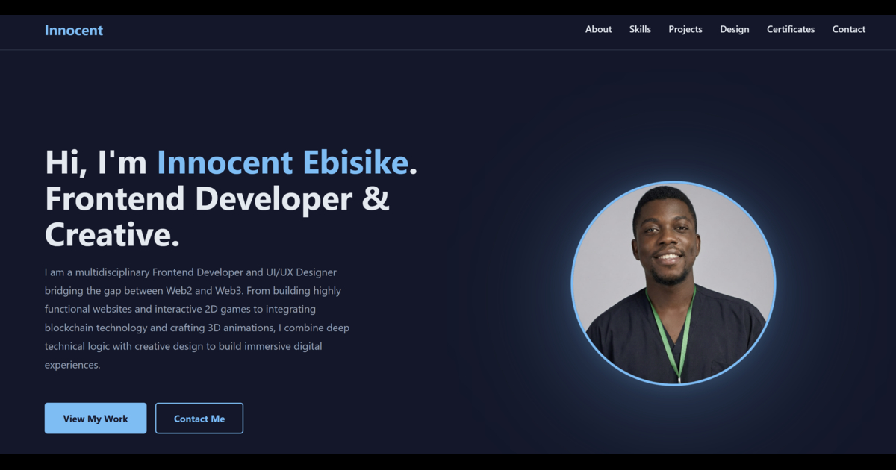

#  Innocent Ebisike - Personal Portfolio

A creative portfolio showcasing my multidisciplinary work as a Frontend Developer and UI/UX Designer, bridging the gap between Web2 and Web3.

** Live Demo:** [View My Portfolio](https://innocentjp-portfolio.netlify.app)

##  About This Project
This repository contains the source code for my personal portfolio website. It serves as a central hub for my digital projects, ranging from interactive 2D games and 3D animations to highly functional websites and blockchain integrations.

##  Built With
* **Frontend:** HTML5, CSS3, JavaScript, React.js
* **Web3 & Game Dev:** Web3.js, Phaser.js, HTML5 Canvas
* **Design Tools:** Figma, PixelLab, Blender

##  Featured Projects

* **[Enugu WaterWatch (EWAW)](https://enugu-waterwatch.netlify.app):** A digital utility platform designed for Enugu State to track public water infrastructure in real-time, report faulty boreholes, and coordinate Smart Tanker Pooling securely. *(Built with: React.js, JavaScript (ES6+), Leaflet.js, CartoDB Voyager, Tailwind CSS)*

* **[CPP Accreditation Portal](https://cppaccreditation.co.uk/):** A fully functional membership and accreditation website built for a professional project management organization, featuring secure routing and responsive data layouts. *(Built with: HTML5, CSS3, JavaScript)*

* **[ABCK Fashion Landing Page](https://abck-fashion-brand.netlify.app/):** A visually engaging e-commerce platform for a modern fashion brand. Features a comprehensive administrative dashboard to manage product inventory and track store updates effectively. *(Built with: HTML5, CSS3, JavaScript)*

* **[Clinical Physiotherapy Site](https://physiotherapy-site.netlify.app/):** A professional, user-friendly clinical website focused on physical therapy services, patient resources, and modern UI/UX design principles. *(Built with: Figma, HTML5, CSS3)*

* **[IAPM&D](https://dr-ayodele-portfolio.netlify.app/):** An executive digital portfolio designed for the founder of the International Academy for Project Management & Development (IAPM&D), showcasing their leadership, professional milestones, and industry expertise. *(Built with: HTML5, CSS3, JavaScript)*

* **[EL Profile / Digital Resume](https://el-profile.netlify.app/):** A sleek, interactive digital profile and resume application designed to beautifully showcase professional milestones and creative design portfolios. *(Built with: React.js, CSS3)*

* **[Aero Glide](https://plane-game-by-innocentjp.netlify.app/):** A high-fidelity, endless arcade flyer featuring dynamic difficulty scaling, custom physics, and responsive mobile controls. *(Built with: Phaser 3, HTML5, CSS3, JavaScript, Native Web Audio)*

* **[Retro Snake Clone](https://snake-game-by-innocentjp.netlify.app/):** A responsive web-based recreation of the classic Snake game, emphasizing core programming logic, array manipulation, and mobile responsiveness. *(Built with: Phaser.js, HTML5 Canvas, JavaScript)*

* **[Web3 Rialo Quiz dApp](https://web3-rialo-quiz.netlify.app/):** A decentralized quiz application integrating blockchain concepts, designed to interact with Web3 wallets and test advanced cryptocurrency knowledge. *(Built with: Web3.js, React.js, Node.js)*

* **[Physiology Academic Quiz](https://physiology-quiz.netlify.app/):** An interactive educational platform tailored for medical rehabilitation students to rigorously test their knowledge of vital signs and exercise physiology. *(Built with: JavaScript, HTML5, CSS3)*

##  Contact

*  **Email:** [innocentebisike73@gmail.com](mailto:innocentebisike73@gmail.com)
*  **GitHub:** [@Innocentjp](https://github.com/Innocentjp)
*  **LinkedIn:** [Innocent Ebisike](https://www.linkedin.com/in/innocent-ebisike)
*  **Twitter (X):** [@EbisikeInnocent](https://twitter.com/EbisikeInnocent)
*  **WhatsApp:** [Message Me](https://wa.me/2349082682461)